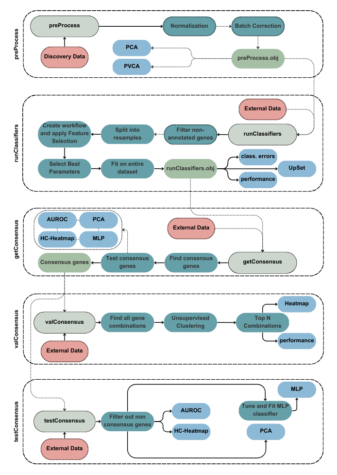

# TENTACLES: Transcriptomics ExploratioN Tool through Aggregation of CLassifiErS

**TENTACLES** is an R package designed to simplify and enhance the analysis of transcriptomic data, with a particular focus on discovering and validating robust biomarkers. By integrating multiple machine learning algorithms, feature selection methods, and consensus-based approaches, TENTACLES provides a powerful and flexible framework for working with RNA-Seq and microarray datasets.

## Workflow Overview

The TENTACLES workflow is built around five key steps:

1.  **Data Preprocessing (`preProcess`)**\
    Start by preparing your dataset with normalization and batch effect correction. This step ensures clean and comparable data. You can also visualize the effects of these corrections using PCA and PVCA plots, both before and after batch correction, for quality assurance.

2.  **Classifier Execution (`runClassifiers`)**\
    Apply up to 15 machine learning classifiers to your data, pairing each with up to 5 feature selection algorithms to identify the most informative features. TENTACLES tunes model parameters, calculates variable importance scores, and provides visualizations, including:

    -   An UpSet plot to show overlapping features.

    -   A heatmap highlighting misclassified samples.

    -   A performance plot comparing classifiers.

3.  **Consensus Identification (`getConsensus`)**\
    Combine results across classifiers to identify overlapping features, helping you uncover robust consensus biomarkers. This step includes detailed visualizations such as:

    -   An AUROC plot for genes showing their discriminative power.

    -   A heatmap and PCA of the consensus features.

    -   Variable importance rankings from a Multi-Layer Perceptron (MLP) model.

4.  **Validation (`valConsensus`)**\
    Validate the consensus biomarkers by testing all possible combinations on external datasets. This step uses six different unsupervised clustering methods to ensure generalizability. Visualizations include:

    -   Model performance plots for the top N combinations of genes.

    -   A heatmap showing AUROC values for these combinations.

5.  **Testing (`testConsensus`)**\
    Further assess the consensus biomarkers on external datasets. This step evaluates their effectiveness using:

    -   PCA.

    -   AUROC plots.

    -   Heatmaps combined with hierarchical clustering.

    -   Tuning and fitting an MLP model for deeper analysis.

The following flowchart illustrates the functionality of TENTACLES:\

### Additional Analyses

Beyond the main workflow, TENTACLES also supports:

-   **Enrichment Analysis**: Perform GO and KEGG enrichment using the `enrich.GO` and `enrich.KEGG` functions. Results can be visualized with `bar.plot` or `circos.plot`.

-   **Protein-Protein Interaction (PPI) Network Analysis**: Use the `ppiNetwork` function to explore relationships between genes and proteins.

## Installation

To install TENTACLES, simply run the following commands in R:
